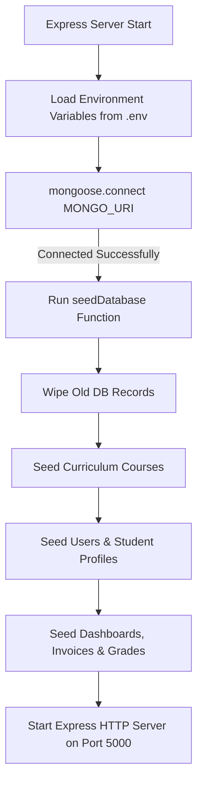
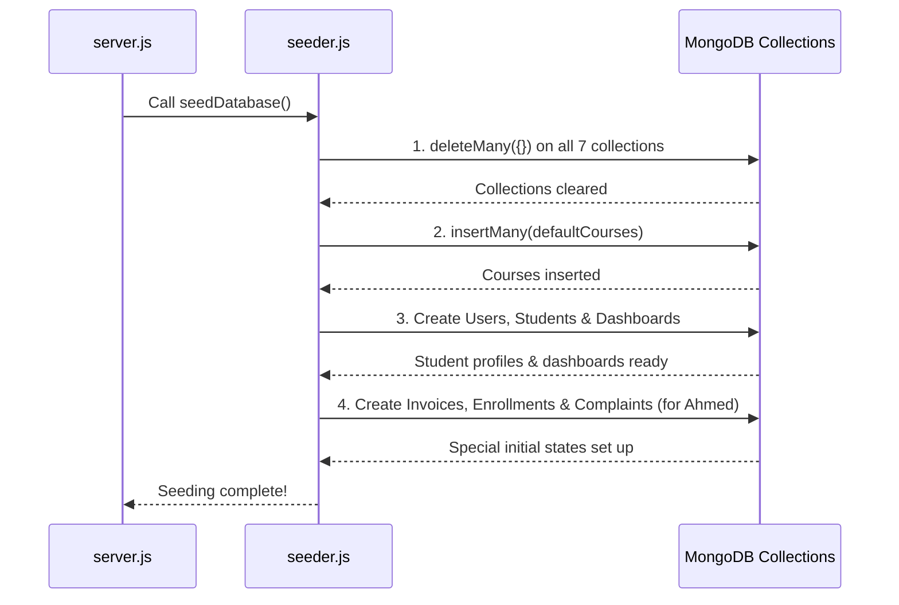

Viewed .env:1-3

Here is a detailed documentation explaining how your MongoDB database connects to the Node.js/Express backend and how data is pre-seeded using [`seeder.js`](file:///c:/Users/insxne/Documents/student-portal/server/utils/seeder.js).

---

# 📚 Database Connection & Seeding Documentation

## 1. System Architecture Overview

Your backend application uses **MongoDB** as its database and **Mongoose** as the Object Data Modeling (ODM) library to connect, map, and interact with the database collections.



---

## 2. Part 1: How the Database Connects to the Backend

The database connection process takes place through three key files:

1. **Environment Configuration**: [`server/.env`](file:///c:/Users/insxne/Documents/student-portal/server/.env)
2. **Server Entry Point**: [`server/server.js`](file:///c:/Users/insxne/Documents/student-portal/server/server.js)
3. **Mongoose Models**: Located in [`server/models/`](file:///c:/Users/insxne/Documents/student-portal/server/models)

### A. Environment Configuration (`.env`)
The database connection URL is defined in [`server/.env`](file:///c:/Users/insxne/Documents/student-portal/server/.env):

```ini
PORT=5000
MONGO_URI=mongodb://127.0.0.1:27017/student_portal
JWT_SECRET=supersecretkey123
```

* `MONGO_URI`: Specifies the protocol (`mongodb://`), host (`127.0.0.1`), default MongoDB port (`27017`), and database name (`student_portal`).

### B. Connection Lifecycle in [`server.js`](file:///c:/Users/insxne/Documents/student-portal/server/server.js#L69-L82)

In [`server.js`](file:///c:/Users/insxne/Documents/student-portal/server/server.js), Mongoose initializes the connection prior to launching the HTTP listener:

```javascript
import dotenv from "dotenv";
import mongoose from "mongoose";
import { seedDatabase } from "./utils/seeder.js";

// Load environment variables from .env file
dotenv.config({ path: './.env' });

// ==========================================
// MONGODB CONNECTION & SEEDING
// ==========================================
mongoose
  .connect(process.env.MONGO_URI)
  .then(async () => {
    console.log("Connected to MongoDB");
    
    // Trigger automated database seeding on server boot
    await seedDatabase();
    
    // Start listening for client HTTP requests only after DB is ready
    app.listen(PORT, () => {
      console.log(`Server is running on port ${PORT}`);
    });
  })
  .catch((err) => {
    console.error("Error connecting to MongoDB:", err);
  });
```

#### How the connection works step-by-step:
1. `dotenv.config()` reads `.env` and populates `process.env.MONGO_URI`.
2. `mongoose.connect()` establishes an asynchronous TCP socket connection to MongoDB.
3. Once the connection resolves (`.then()`), the app executes `seedDatabase()` to ensure the database has initial data.
4. After seeding finishes, `app.listen(PORT)` starts listening for requests. If MongoDB fails to connect, the server logs the error and halts.

---

## 3. Part 2: How Data is Pre-Seeded via `seeder.js`

The file [`server/utils/seeder.js`](file:///c:/Users/insxne/Documents/student-portal/server/utils/seeder.js) acts as an automated database initializer. Every time the server starts, `seedDatabase()` executes a **4-step process**:



---

### Detailed Code Breakdown of [`seeder.js`](file:///c:/Users/insxne/Documents/student-portal/server/utils/seeder.js)

#### Step 1: Purging Existing Collections (Clean Slate)
To prevent duplicate records on server restarts, the seeder wipes existing records:

```javascript
await Dashboard.deleteMany({});
await Course.deleteMany({});
await User.deleteMany({});
await Student.deleteMany({});
await Grade.deleteMany({});
await Invoice.deleteMany({});
await Complaint.deleteMany({});
```

#### Step 2: Seeding the Curriculum Courses
The array `defaultCourses` contains 35+ Computer Science courses mapped to levels (100L–400L) and semesters (1 & 2):

```javascript
await Course.insertMany(defaultCourses);
```

Each course contains fields such as `courseCode` (e.g., `"CSC 101"`), `title`, `credits`, `level`, `semester`, and `remarks`.

#### Step 3: Seeding Mock Users, Students, & Dashboards
The seeder defines 3 pre-configured student accounts:

1. **Ahmed Adewole** (`ahmed@pcu.edu.ng` / Matric: `2022/502` / 100L Sem 1)
2. **Jane Doe** (`jane@pcu.edu.ng` / Matric: `2023/101` / 200L Sem 2)
3. **Michael Smith** (`michael@pcu.edu.ng` / Matric: `2021/304` / 300L Sem 1)

For each student entry in `mockStudents`, the seeder executes:

```javascript
// 1. Create User (Auth document)
const user = await User.create({
  email: data.email,
  matricNo: data.matricNo,
  passwordHash: data.password, // Plaintext password for testing/demo
  role: 'student'
});

// 2. Create Student (Academic profile linked via userId)
const student = await Student.create({
  userId: user._id,
  matricNo: data.matricNo,
  name: data.name,
  batch: data.batch,
  degree: data.degree,
  currentSemester: data.currentSemester,
  creditsCompleted: data.creditsCompleted,
  creditsRequired: data.creditsRequired
});

// 3. Create Dashboard (Overview stats document linked via studentId)
await Dashboard.create({
  studentId: student._id,
  welcome: { name: data.name, matricNo: data.matricNo, level: data.levelStr, programme: data.degree, ... },
  clearance: { completed: 4, total: 6, items: [...] },
  semester: { label: data.semesterLabel, stage: data.stage, week: 4, totalWeeks: 12, ... }
});
```

#### Step 4: Seeding Initial Invoices, Enrollments & Complaints
For **Ahmed Adewole** (`2022/502`), the seeder sets up a complete active scenario to test portal locks and financial workflows:

```javascript
if (data.matricNo === '2022/502') {
  // Fetch 100L Sem 1 courses
  const sem1Courses = await Course.find({ level: 100, semester: 1 });
  const courseIds = sem1Courses.map(c => c._id);

  // Create a locked Enrollment record
  const enrollment = await Enrollment.create({
    studentId: student._id,
    semester: 1,
    status: 'locked',
    recommendedCourses: courseIds,
    selectedCourses: courseIds
  });

  // Create a pending Invoice linked to the Enrollment
  await Invoice.create({
    studentId: student._id,
    enrollmentId: enrollment._id,
    semester: 1,
    status: 'pending',
    lineItems: [{ courseCode: "School Fees", amount: 150000 }],
    totalAmountDue: 150000,
    amountPaid: 0
  });

  // Create a support Ticket/Complaint
  await Complaint.create({
    studentId: student._id,
    ticketId: "TKT-99123",
    title: "Registration Error",
    description: "My courses are not fully displaying.",
    status: "pending"
  });
}
```

---

## 4. Default Seeded Accounts for Testing

When your backend starts, you can log in immediately using these credentials:

| Role | Username / Matric | Password | Purpose |
| :--- | :--- | :--- | :--- |
| **Student** | `2022/502` | `password123` | **Ahmed Adewole**: Has pending tuition invoice & locked result view. |
| **Student** | `2023/101` | `password123` | **Jane Doe**: 200L student with existing grades. |
| **Student** | `2021/304` | `password123` | **Michael Smith**: 300L student. |
| **Admin** | `admin` | `admin` | **Admin Portal Access**: Financial approvals, clearance control, ticket replies. |